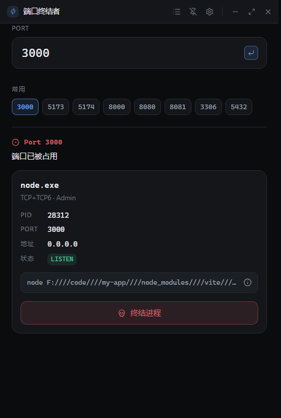
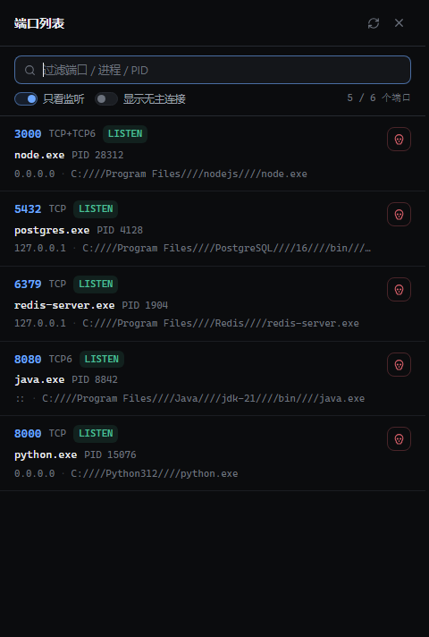

<div align="center">

# 端口终结者 / Port Killer

[**English**](./README.md) · **简体中文**

**不用再查「到底是谁占了我的端口」。**

输入端口 → 看到占用进程 → 一键终结 → 回去干活。

[](./LICENSE)
[](#安装)
[](https://tauri.app/)
[](https://www.rust-lang.org/)
[](./SECURITY.md)



</div>

---

## 为什么做这个

`Address already in use.`

每个开发者都遇到过。通常的解法是一串每次都要现查的命令 —— 先 `netstat` / `lsof`
找到 PID，再 `taskkill` / `kill` 干掉它，最后还得再查一次确认真的释放了。
一天要来好几回，每次都是半分钟的摩擦。

端口终结者把它变成：一个输入框 + 一个按钮。

## 功能

| | |
| --- | --- |
| **端口查询** | 输入端口，看到占用它的进程 —— 进程名、PID、协议、绑定地址、TCP 状态、以及它是怎么被启动的 |
| **一键终结** | 确认目标（明确列出进程名 + PID + 端口）→ 终结 → **回系统重查端口**，确认真的释放了才说成功 |
| **强制终结** | 只在普通终结失败**之后**才出现，且需要**独立的二次确认**。永远不是默认按钮 |
| **端口列表** | 全窗抽屉，列出本机所有端口占用。默认**只显示监听中的端口** —— 那才是「被占用」的答案；可切换查看全部连接与无主连接 |
| **窗口置顶** | 让窗口浮在终端之上 —— 毕竟报错信息是在终端里看到的 |
| **中英双语** | 跟随系统语言，可在设置里切换 |
| **主题** | 跟随系统 / 深色 / 浅色。窗口外壳也跟着应用主题走，而不是跟着操作系统 |
| **键盘** | <kbd>Enter</kbd> 查询 · <kbd>Esc</kbd> 关闭 · <kbd>Ctrl/⌘</kbd>+<kbd>K</kbd> 聚焦输入框 |

<div align="center">

</div>

### 它不是什么

不是系统监控器，也不是任务管理器。没有轮询、没有仪表盘、没有历史记录。
它只做一件事：**把你卡住的那个端口释放掉。**

## 安装

### 下载预编译包

到 [**Releases**](https://github.com/zazahui98/port-killer/releases) 下载对应平台的安装包。

| 平台 | 产物 |
| --- | --- |
| Windows | `.exe`（NSIS 安装包，当前用户安装） |
| macOS | `.dmg` |
| Linux | `.deb` / `.AppImage` |

> 还没有 release？直接从源码构建，几分钟的事。

### 从源码构建

需要 **Node.js ≥ 22** 与 **Rust ≥ 1.77**，以及
[Tauri 系统依赖](https://v2.tauri.app/start/prerequisites/)。

```bash
git clone https://github.com/zazahui98/port-killer.git
cd port-killer
npm ci
npm run tauri:build
```

产物在 `src-tauri/target/release/bundle/`。

只要可执行文件、不要安装包：

```bash
npm run tauri:build -- --no-bundle
```

## 使用

1. 输入端口（比如 `3000`），按 <kbd>Enter</kbd>。
2. 如果有进程在监听，会看到进程卡片。
3. 点**终结进程**，确认，完事。

**关于权限**：以普通用户运行时，只能终结**你自己**的进程。
要终结其他用户或系统进程，请以管理员 / root 身份运行。
遇到这种情况应用会明确说明原因并给出解决办法 —— 不会静默失败。

## 实现方式

「端口 → 进程」的映射全部在 Rust 侧完成，且**不产生任何子进程**：

| 平台 | 机制 |
| --- | --- |
| Windows | `GetExtendedTcpTable` / `GetExtendedUdpTable`（IP Helper API），终结走 `OpenProcess` + `TerminateProcess` |
| Linux | `/proc/net/{tcp,tcp6,udp,udp6}` → socket inode → `/proc/<pid>/fd`，终结走 `kill(2)` |
| macOS | 直接 `execve` 执行 `lsof`（**不经过 `sh -c`**），终结走 `kill(2)` |

不存在由用户输入拼出的命令行，因此没有命令注入面。
完整设计见 [`docs/ARCHITECTURE.zh-CN.md`](./docs/ARCHITECTURE.zh-CN.md)。

## 技术栈

| 层 | 选型 |
| --- | --- |
| 桌面框架 | **Tauri 2** —— 安装包小，后端是真正的 Rust |
| 前端 | **React 19 + TypeScript**（`strict`、`noUncheckedIndexedAccess` 全开） |
| 构建 | **Vite 8**（rolldown） |
| 样式 | **Tailwind CSS 4** —— 设计令牌集中在 `src/styles.css` |
| 图标 | **Lucide** |
| 状态 | React `useReducer` —— 这个规模刻意不引入 Zustand |
| 国际化 | **i18next** + **react-i18next** |
| 原生层 | **Rust** —— `sysinfo`、`windows-sys`、`libc` |

依赖刻意保持精简：Rust 侧 4 个直接依赖，前端 6 个运行时包。

## 项目结构

```text
port-killer/
├── src/                        React 前端
│   ├── components/             TitleBar、PortInput、ProcessCard、PortListDrawer…
│   ├── hooks/                  状态机、端口列表、窗口控制、主题、i18n
│   ├── i18n/locales/           en.ts · zh-CN.ts
│   ├── services/portService.ts 唯一的 IPC 通道
│   └── types/port.ts           与 Rust 共享的数据契约
├── src-tauri/                  Rust 原生层
│   ├── src/commands.rs         Tauri 命令边界
│   ├── src/platform/           各平台的 ProcessProvider
│   │   ├── windows.rs          IP Helper API + TerminateProcess
│   │   ├── linux.rs            /proc 解析
│   │   ├── macos.rs            lsof（直接 execve）
│   │   ├── state.rs            TCP 状态映射      ─┐ 与平台无关，
│   │   ├── proc_net.rs         /proc/net 解析     │ 测试在所有平台都跑
│   │   ├── lsof_parser.rs      lsof 字段解析      │
│   │   └── aggregate.rs        socket → 进程     ─┘
│   └── tests/                  真起监听、真终结、真复查
├── docs/                       架构文档与截图
├── scripts/                    i18n 校验、图标生成、离线安装包辅助
└── .github/                    CI / 发布工作流、Issue 模板
```

## 开发

```bash
npm ci
npm run tauri:dev          # 桌面应用，热更新
npm run dev                # 只跑前端，在浏览器里调 UI（原生功能会报错）
```

提交 PR 前，跑一遍 CI 会跑的检查：

```bash
npm run typecheck && npm run lint && npm run format:check && npm run i18n:check
npx vite build

cargo fmt --manifest-path src-tauri/Cargo.toml --all -- --check
cargo clippy --manifest-path src-tauri/Cargo.toml --all-targets -- -D warnings
cargo test --manifest-path src-tauri/Cargo.toml
```

项目里的硬性约定（以及**为什么**有这些约定）见 [CONTRIBUTING.zh-CN.md](./CONTRIBUTING.zh-CN.md)。

### 网络受限？

部分网络环境下 GitHub 不可达，会导致 `tauri build` 失败（它要从 GitHub Releases
下载打包工具链）。这种情况下用：

```bash
bash scripts/build-installer.sh
```

它从另一个官方来源取同一份工具链，校验 SHA-1 后放进 bundler 缓存。
细节见脚本头部注释与 CONTRIBUTING.md。

## 测试

**75 个 Rust 测试全部通过**，其中最有价值的那些**全部使用真实系统资源，没有任何 mock**：

| 套件 | 数量 | 覆盖内容 |
| --- | --- | --- |
| 单元测试（`src/`） | 59 | 端口/PID 校验、错误序列化、字节序解码、缓冲区越界防御、TCP 状态映射、`/proc` 与 `lsof` 解析、聚合逻辑 |
| 命令层 | 9 | **前端实际调用的那条路径** —— 参数校验、`spawn_blocking` 调度、错误转换，以及**验收全流程** |
| 原生集成 | 7 | 真起监听 → 真查询 → 真终结 → 真复查 |

验收流程测试会起一个占着端口的子进程，找到它、终结它，然后**重新查询端口**
确认真的释放了。

纯逻辑的解析器（`state.rs`、`proc_net.rs`、`lsof_parser.rs`、`aggregate.rs`）
刻意**不带 `#[cfg(target_os)]` 门控**。被 `cfg` 门控的模块在其它平台上不参与编译，
其中的测试也就不会执行；抽到无门控模块后，同一套测试就能覆盖所有平台。

## 安全

这个程序的本职工作就是终结进程，所以这就是它的威胁模型。

- 完全离线运行 —— 无遥测、无账号、不发起任何网络请求
- 不产生子进程；不存在由用户输入拼出的命令行
- 端口与 PID 在 IPC 边界**两侧**各自校验
- 严格 CSP + `freezePrototype`；capabilities 只放开自绘标题栏真正需要的那几项窗口能力
- 终结后会回系统复查，从不假设成功

发现问题请先读 [SECURITY.zh-CN.md](./SECURITY.zh-CN.md) —— **安全漏洞请勿开公开 Issue。**

## 贡献

欢迎 Issue 与 PR。动手前请先看 [CONTRIBUTING.zh-CN.md](./CONTRIBUTING.zh-CN.md)，
里面写清了那些不那么显然的约束（不用 shell、不拼命令行、终结后必须复查、
强制终结永不是默认动作），省得你重新踩一遍。

## 许可证

[MIT](./LICENSE)
